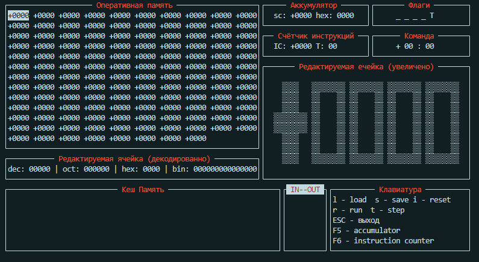

# My Simple Computer

## Build

```
make
```

## Simple Basic Translator to Simple Assembler

```
./simplebasic/sbt <INPUTFILENAME.sb>
```

## Simple Assembler Translator to machine code

```
./simpleassembler/sat <INPUTFILENAME.sa> <OUTPUTFILENAME.o>
```

## Run

```
cd console
./app
```


